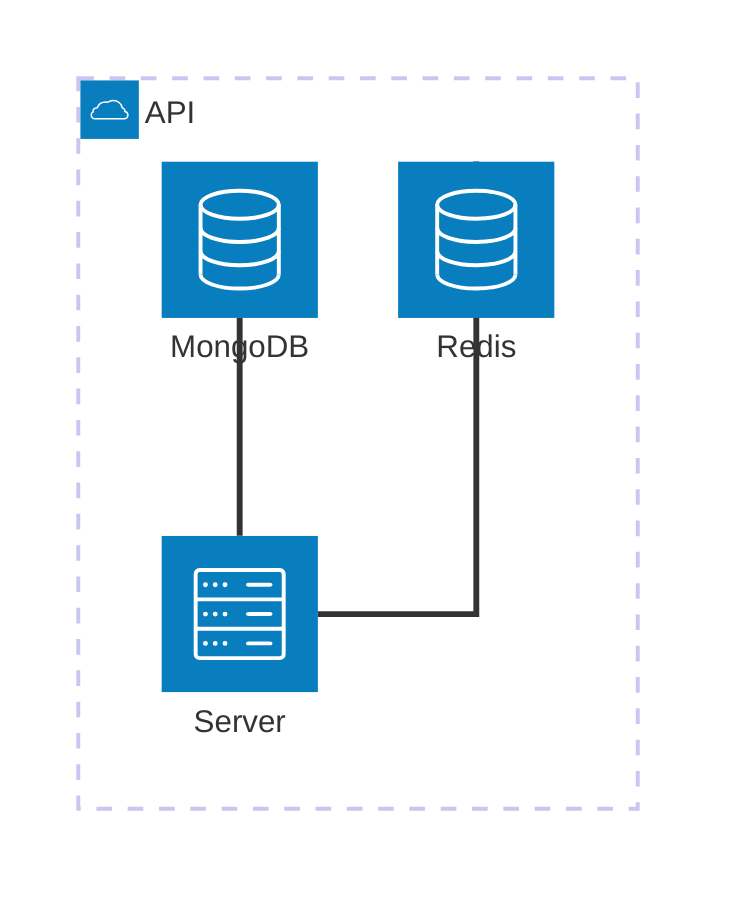
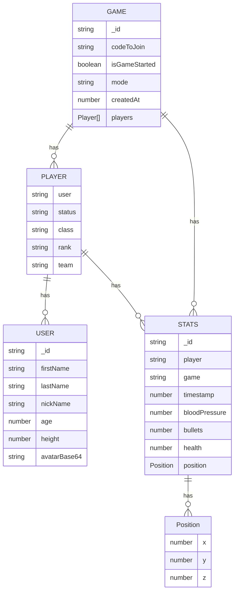
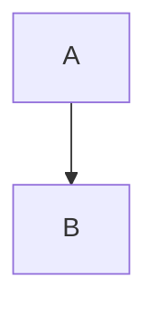

# WORK IN PROGRESS

# Techstack

## Backend

### Language

- TypeScript

### Framework

- NestJS

### Database

- MongoDB
- Redis

## Poligon (frontend)

### Language

- TypeScript

### Framework

- React

### Core dependencies

- Cesium
- Resium
- MaterialUi

## Mobile

### Language

- TypeScript

### Framework

- React Native

# Architecture

